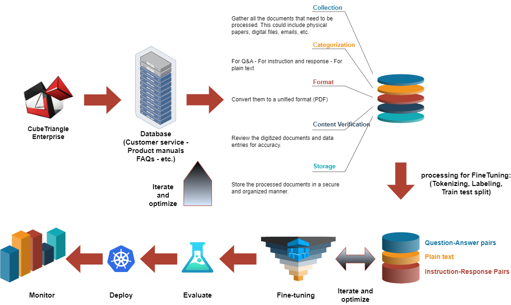
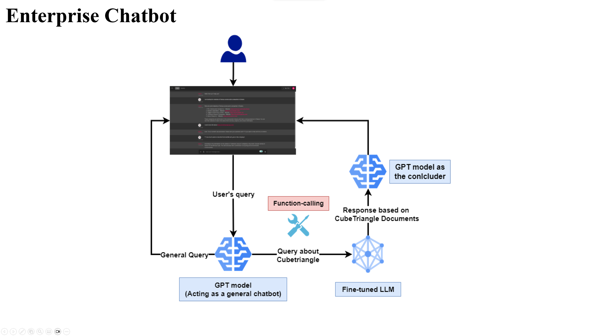

# Fine-tuning: Fine-tuning LLMs on dataset of a fictional company

Designed the pipeline to process raw data of a fictional company, finetuned 3 large language models (LLMs) on it, and designed a chatbot using the best model.

### Models used for fine tuning
* Pythia_70m: https://huggingface.co/EleutherAI/pythia-70m
* dlite_v2_1.5b: https://huggingface.co/aisquared/dlite-v2-1_5b
* Open_llama_3b: https://huggingface.co/openlm-research/open_llama_3b
 

## Fine-tuning process schema

  

## Chatbot Schema

  

